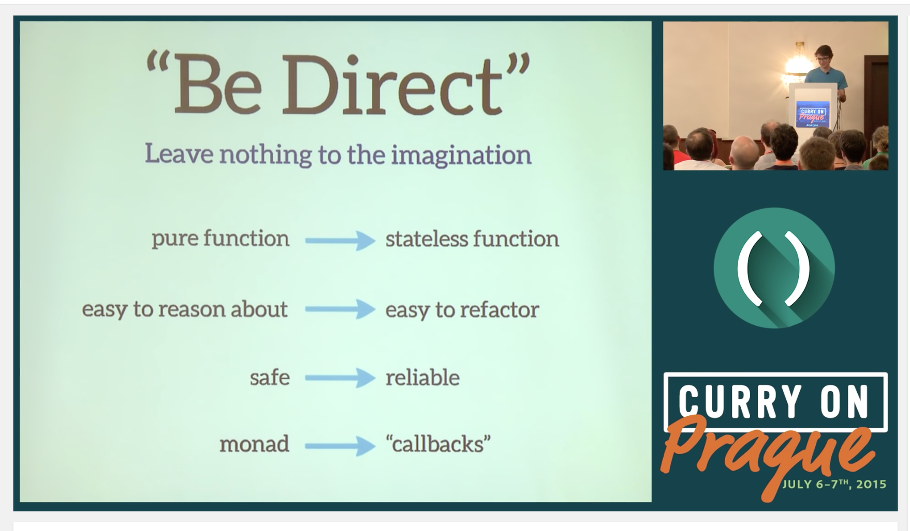
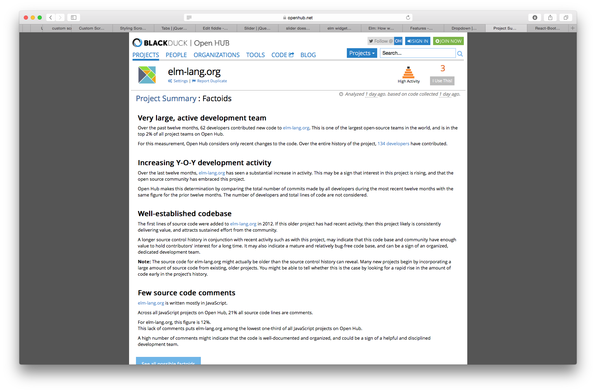
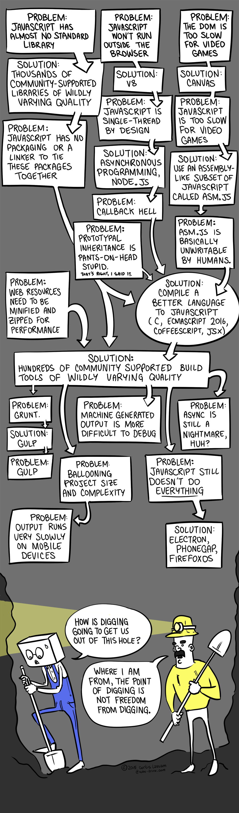

# Learning Elm

* [Elm course from Pragmatic Studio](https://pragmaticstudio.com/courses/elm)
* [Awesome Elm - a set of links to Elm talks, code, tutorials etc](https://github.com/isRuslan/awesome-elm)
* Richard  Feldman - [Tour of an Open-Source Elm SPA](https://dev.to/rtfeldman/tour-of-an-open-source-elm-spa)

### Other links
* [Elmctron - Elm + Electron](http://www.gizra.com/content/elm-electron-build/) desktop apps in Elm

### Avoid thinking in terms of components in Elm

[Evan discusses his concerns with the use of the word component](https://www.reddit.com/r/elm/comments/4xsqhd/practical_examples_in_elm/?)
Summary: components == objects and we don't make an Elm program out of objects.

Gem:

> Elm doesn't have monads and applicative functors. Instead, we thought about it for a few years until we came up with the name `andThen`. We avoided a whole boatload of pedagogical problems by choosing the right term and framing. People just "get it" and no one has to write a tutorial

* [Discussion of modules and components](utm_source=DailyDrip+Elm+Public+List&utm_campaign=3fd10707d0-Elm_Weekly_Drip_20_8_27_2016&utm_medium=email&utm_term=0_5663aebb97-3fd10707d0-142982941#!topic/elm-discuss/_cfOu88oCx4)
* [Evan in Elm autocomplete video](https://www.youtube.com/watch?v=KSuCYUqY058&feature=youtu.be&t=1h14m50s)
* [Another discussion on private state](https://groups.google.com/forum/?utm_source=DailyDrip+Elm+Public+List&utm_campaign=3fd10707d0-Elm_Weekly_Drip_20_8_27_2016&utm_medium=email&utm_term=0_5663aebb97-3fd10707d0-142982941#!topic/elm-discuss/_cfOu88oCx4)
* [Elm sortable table](https://github.com/evancz/elm-sortable-table)
* [How to get rid of most of that boilerplate in the elm-mdl library ](https://medium.com/@debois/elm-components-3d9c00c6c612#.b8euskn3z)
* [Elm component support](http://package.elm-lang.org/packages/emtenet/elm-component-support/1.0.0)
* [Elm packages](http://package.elm-lang.org)

### Decoding and Encoding binary in Elm

* [Elm Crypto](https://github.com/Strikeskids/elm-crypto) - has Javascrip ArrayBuffer bindings
* [Google groups: Support for binary data](https://groups.google.com/forum/#!topic/elm-discuss/spr621OlUeo)
* [Google groups: Collecting use cases for File, ArrayBuffer and TypedArrays/DataViews](https://groups.google.com/forum/#!topic/elm-discuss/u_ui3PlDwLc)

### Anti-Javascript propaganda

* [What it feels like to learn Javascript in 2016](https://hackernoon.com/how-it-feels-to-learn-javascript-in-2016-d3a717dd577f#.2noc5vuhb)
* [Javascript fatigue](https://medium.com/@ericclemmons/javascript-fatigue-48d4011b6fc4#.md53ojc16)

### If you are forced to use Javascript
* [Ramda - A practical functional library for JavaScript programmers](http://ramdajs.com)
* [Typescript](https://www.typescriptlang.org)
* [Flow - a static type checker for Javascript](https://flow.org)
